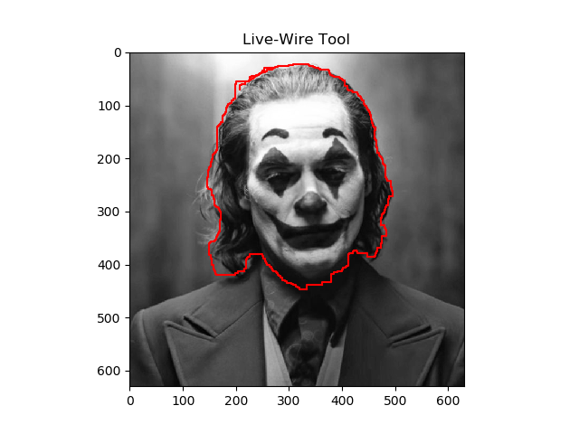

# Intelligent-Scissors
Intelligent scissors application

This repo includes the scipt for intelligent scissors tool applied Dijkstra's algorithm.

Reference: https://github.com/pdyban/livewire

## Requirements
- Python 2.7
- scikit-image, matplotlib

## Usage
1. Run the script
2. When the pop-up window is displayed, choose the seed points using mouse
3. Press ESC on the keyboard to yield the output

## Live-Wire Output

Oct. 2019

Tran Le Anh
