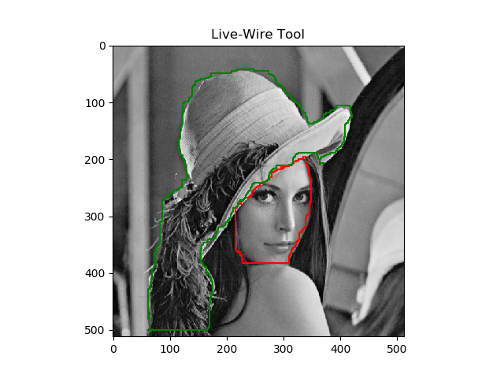
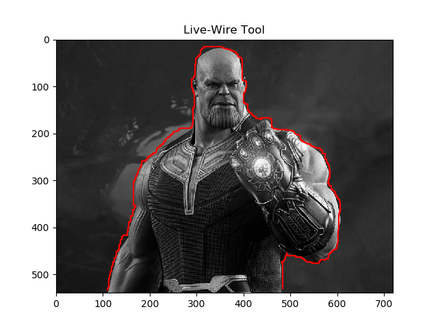

# Intelligent-Scissors
Intelligent scissors application

This repo includes the scipt for intelligent scissors tool applied Dijkstra's algorithm.

Reference: 
- https://github.com/pdyban/livewire
- https://zhengrui.github.io/iscissor.html

## Requirements
- Run on Python 2.7 or Python 3.6
- scikit-image, matplotlib

## Usage
1. Run the script
- Python 2.7
```bashrc
$ python intel_scissors.py
```
- Python 3.6
```bashrc
$ python3 intel_scissors_py3.py
```
2. When the pop-up window is displayed, choose the seed points using mouse
3. Press ESC on the keyboard to yield the output

## Live-Wire Output





Oct. 2019

Tran Le Anh
